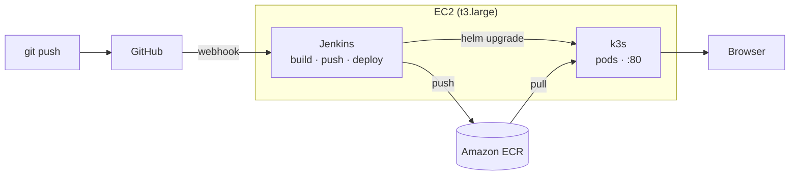
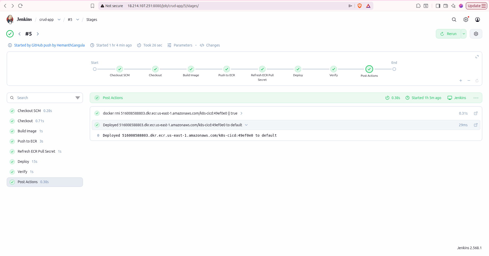
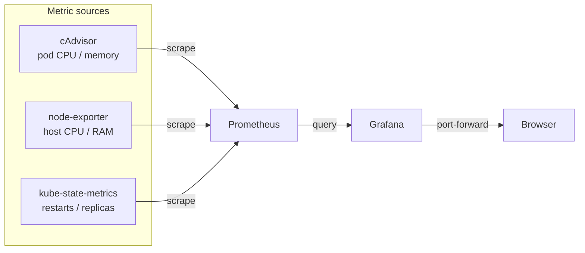
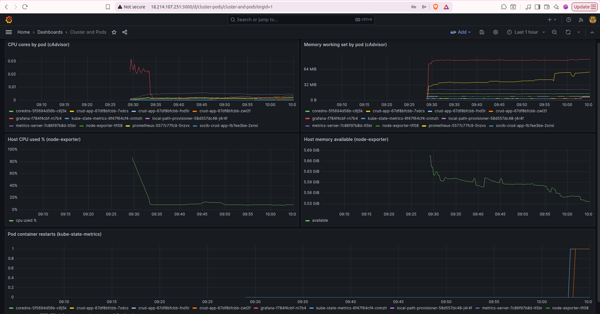

# k8s-cicd: CI/CD Pipeline with Git, Jenkins, and Kubernetes

A commit to the Git repository triggers a Jenkins build, and on success the new version
is deployed to a Kubernetes cluster. If the deployment fails, it rolls back on its own
so the running app stays up. The sample app is a small React CRUD app; it is only there
to give the pipeline something to build and deploy.



Everything runs on one EC2 instance with a public IP. The reason for the public IP is
the Git trigger: GitHub has to reach Jenkins to deliver the webhook, and it cannot reach
a laptop without a tunnel like ngrok, so a public instance makes the trigger work
directly. k3s is used for Kubernetes because it is light enough to run on the same box
and can be stopped with the instance. ECR is kept because Docker and Kubernetes do not
share image storage, so the image needs a registry both can reach, and tagging each
build by commit is what makes rollback possible.

## Repository layout

```
application/            React app and its Dockerfile
helm/crud-app/          Helm chart (deployment, service, values)
Jenkinsfile             the pipeline definition
monitoring/             Prometheus and Grafana manifests (optional)
```

## Setup

### 1. EC2 instance

Launch a t3.large with Ubuntu and about 30 GB of disk. Allocate an Elastic IP and attach
it so the public IP stays the same across stop and start (the webhook points at this IP).

Open in the security group:

- Port 22 (SSH): your IP only
- Port 8080 (Jenkins): your IP, and GitHub's webhook ranges from `https://api.github.com/meta`
- Port 80 (app): open to everyone

### 2. Tools on the instance

```bash
# Docker
sudo apt-get update && sudo apt-get install -y docker.io
sudo usermod -aG docker ubuntu   # log out and back in after this

# k3s, with the built-in Traefik disabled so it does not hold port 80
echo "disable: traefik" | sudo tee /etc/rancher/k3s/config.yaml
curl -sfL https://get.k3s.io | sh -
mkdir -p ~/.kube && sudo cp /etc/rancher/k3s/k3s.yaml ~/.kube/config
sudo chown $USER:$USER ~/.kube/config && chmod 600 ~/.kube/config
export KUBECONFIG=~/.kube/config

# Helm
curl -fsSL https://raw.githubusercontent.com/helm/helm/main/scripts/get-helm-3 | bash

# AWS CLI
sudo apt-get install -y unzip
curl -s "https://awscli.amazonaws.com/awscli-exe-linux-x86_64.zip" -o awscliv2.zip
unzip -q awscliv2.zip && sudo ./aws/install
```

### 3. ECR and IAM

Create a private ECR repository named `k8s-cicd` with scan-on-push enabled. Instead of
storing AWS keys, create an IAM role that EC2 can assume, allow it to push and pull only
this repository (plus `ecr:GetAuthorizationToken`), and attach it to the instance under
Actions, Security, Modify IAM role. The instance then gets temporary credentials
automatically.

### 4. Jenkins

```bash
sudo apt-get install -y fontconfig openjdk-21-jre
sudo wget -O /etc/apt/keyrings/jenkins-keyring.asc \
  https://pkg.jenkins.io/debian-stable/jenkins.io-2026.key
echo "deb [signed-by=/etc/apt/keyrings/jenkins-keyring.asc] https://pkg.jenkins.io/debian-stable binary/" \
  | sudo tee /etc/apt/sources.list.d/jenkins.list
sudo apt-get update && sudo apt-get install -y jenkins

# give the jenkins user Docker access and a kubeconfig
sudo usermod -aG docker jenkins
sudo mkdir -p /var/lib/jenkins/.kube
sudo cp /etc/rancher/k3s/k3s.yaml /var/lib/jenkins/.kube/config
sudo chown -R jenkins:jenkins /var/lib/jenkins/.kube
sudo chmod 600 /var/lib/jenkins/.kube/config
sudo systemctl restart jenkins
```

Open `http://<public-ip>:8080`, unlock with the password in
`/var/lib/jenkins/secrets/initialAdminPassword`, install the suggested plugins, and
create an admin user.

### 5. Pipeline job and webhook

Create a Pipeline job. Under Pipeline, choose "Pipeline script from SCM", set Git, enter
the repository URL, set the branch to `main`, and leave the script path as `Jenkinsfile`.
Under Build Triggers, tick "GitHub hook trigger for GITScm polling".

In GitHub, go to Settings, Webhooks, Add webhook. Payload URL
`http://<public-ip>:8080/github-webhook/`, content type `application/json`, push event.

Every push now runs the pipeline.

## What the pipeline does

Defined in the `Jenkinsfile`, it runs in order:

1. **Checkout** the pushed commit and read its short hash, used as the image tag.
2. **Build** the Docker image (compiled in Node, served by nginx).
3. **Push** the image to ECR using the instance's IAM role.
4. **Refresh the pull secret** the cluster uses to pull from ECR, since ECR tokens
   expire after twelve hours. This creates or updates the secret and keeps the token out
   of the build log.
5. **Deploy** with `helm upgrade --install`. Helm sets the new image tag on the
   Deployment; k3s then starts new pods and pulls that image from ECR. Helm waits for
   the pods to become healthy and rolls back to the previous version if they do not.
6. **Verify** the rollout finished.

The build and the deploy use the same commit hash, so the version built is always the
version deployed.



## Using a different repository or cluster

The pipeline does not hardcode app-specific values. These are parameters at the top of
the `Jenkinsfile`:

- `ECR_REPO`: image registry and repository
- `AWS_REGION`: region
- `HELM_RELEASE`: release name
- `NAMESPACE`: Kubernetes namespace

For a different application, point a new Jenkins job at that repo's `Jenkinsfile` and
adjust the parameters. For a different cluster, change the `KUBECONFIG` path in the
environment block to that cluster's config. The rest of the pipeline is unchanged.

## Failure handling and security

The deploy uses Helm's atomic mode: if the new version fails its health checks within
the timeout, Helm restores the last working release, so a bad commit does not take the
app down. The readiness and liveness probes in the Helm chart are what let the cluster
detect a bad pod and trigger this. The pipeline prints a clear success or failure
message at the end.

On security: no long-lived AWS keys are stored (the instance uses an IAM role scoped to
the one ECR repository), the ECR token is never printed in logs, Jenkins on 8080 is only
reachable from my IP and GitHub's ranges, the container runs as non-root with capability
drops and resource limits, and ECR scans each image on push.

## Monitoring

An optional Prometheus and Grafana setup lives in `monitoring/`, in its own
`monitoring` namespace so it is fully separate from the app and the pipeline. It is
applied by hand and kept deliberately small, since it shares the box with Jenkins and
k3s.

It pulls metrics from three sources, each covering a different layer:

- **cAdvisor**, which the k3s kubelet already exposes, for per-pod CPU and memory. This
  is scraped through the API server, so no extra pod is needed for it.
- **node-exporter**, a DaemonSet, for the host itself: CPU, memory, and disk of the EC2
  instance.
- **kube-state-metrics** for object state, such as pod restarts and deployment replicas.
  It is limited to pods and deployments, so the permissions it needs stay small.



Grafana comes up with the Prometheus datasource and one dashboard already loaded, so
there is nothing to click to set up. The dashboard shows CPU and memory per pod, host
CPU and memory, and pod restarts.

```
kubectl apply -f monitoring/
kubectl -n monitoring get pods        # wait for all four to be Running
```

Each pod has a hard memory limit and Prometheus keeps only one day of data, so the
whole thing stays under about 600 MiB and cannot starve Jenkins or the app.

Access is by port-forward rather than a public port, so Grafana is not exposed to the
internet:

```bash
kubectl -n monitoring port-forward svc/grafana 3000:3000       # then http://localhost:3000
kubectl -n monitoring port-forward svc/prometheus 9090:9090
```

The sample app is static nginx and has no metrics endpoint of its own, so this covers
the infrastructure layer rather than application metrics. If the app exposed `/metrics`,
the same Prometheus would pick it up with one more scrape job.



## Trying it out

Change something in `application/src`, commit, and push. Jenkins runs on its own and the
change is live at `http://<public-ip>/` in a few minutes. Confirm the running version:

```bash
kubectl get deploy crud-app -o jsonpath='{..image}'
```

The tag at the end is the commit that was deployed. To see the rollback, push a change
that breaks the app or its health check; the deploy fails and the previous version keeps
serving. The app login is `admin@example.com` / `qwerty`.

A t3.large costs about two dollars a day running and very little stopped. k3s keeps its
state on disk, so stopping and starting the instance is safe.

The sample CRUD app is based on
[safdarjamal/crud-app](https://github.com/safdarjamal/crud-app); this project adds the
Dockerfile, Helm chart, and pipeline around it.
